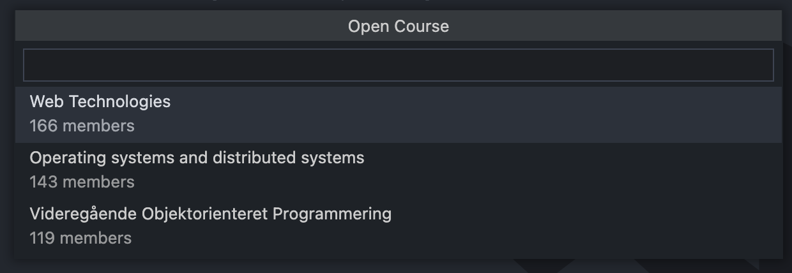
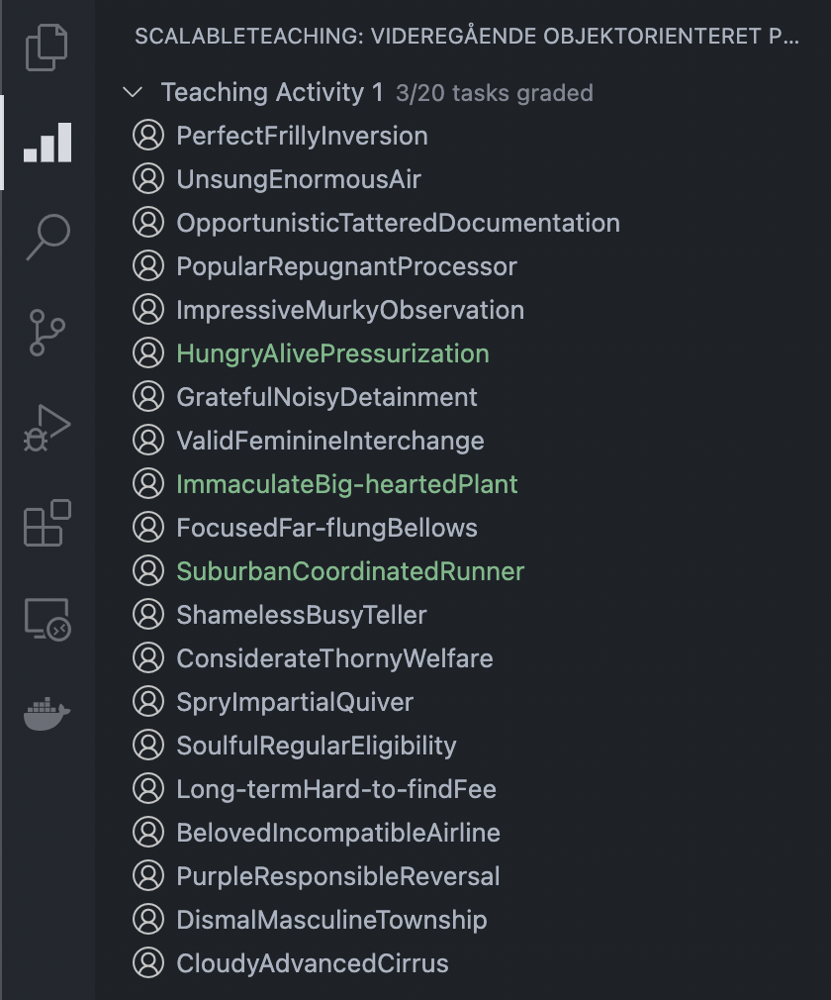
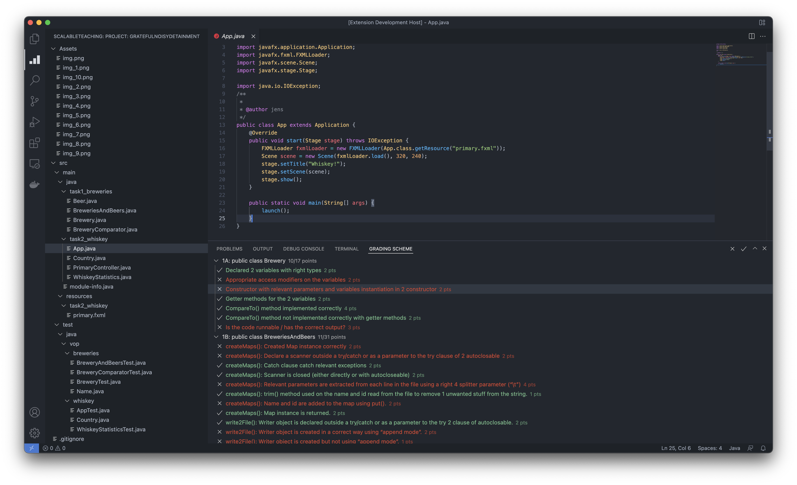

# ScalableTeaching Assignment Grading

This extension collaborates with your [ScalableTeaching web application](https://github.com/SDU-SW-Engineering/ScalableTeaching) and allows teaching assistants, professors, and the like to grade students' code assignments more efficiently.

## Benefits
Grading software manually is __rarely__ fun. Having to grade many students is not only cumbersome, but it can often become hard to keep track of everything. This extension aims to solve this problem by combing grading schemes directly with student files, making it easier to keep track and making it harder to make mistakes stemming from mixing students.

### Pseudonyms
Tasks are hidden behind pseudonyms, meaning grader is unaware of who they are grading.

## Screenshots

Picking a course available to the authenticated user.

List of tasks that should be graded. Already graded tasks are green.

The grading view gives an overview of the student's code and an easily togglable list of points that the student can earn. The person grading can thus quickly go through each point and make sure the student fulfills the criteria.

## Configuration

Before the application can be used, the `Server` entry in preferences needs to be set; once done, you should be able to authenticate through the web UI.

## Usage

Your user needs to be tied to a course within your ScalableTeaching instance and has gradings delegated; otherwise, the task list will be empty.

Afterwards simply pick a task and start grading.